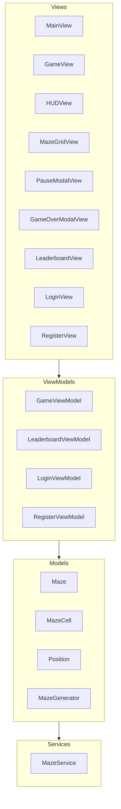
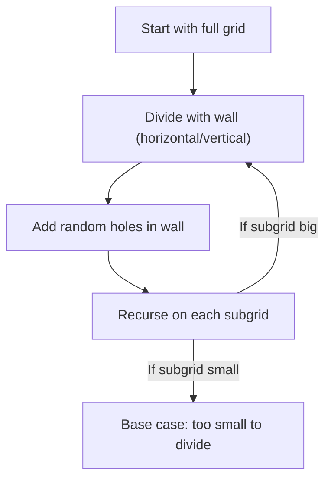
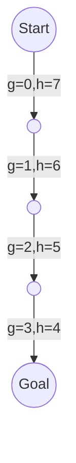
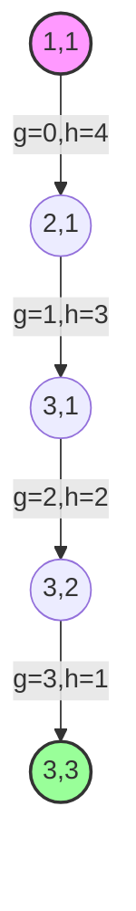
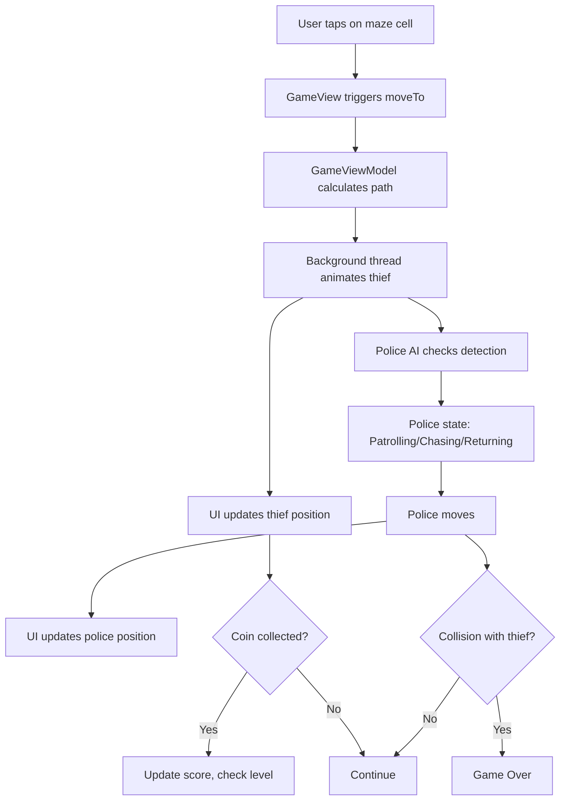

# 🚨 Escape The Police

Welcome to **Escape The Police**! 🕵️‍♂️🚔💰

A SwiftUI game where you play as a thief collecting coins in a procedurally generated maze, while avoiding patrolling police. The game features smooth animations, multithreaded logic for responsive UI, and smart enemy AI.

---

## 🧩 Game Overview

- **You are the thief** (`🕵️‍♂️`), starting at the maze entrance.
- **Collect all coins** (`💰`) to advance to the next level.
- **Avoid the police** (`🚔`), who patrol, chase, and return to their routes.
- **Each level**: new maze, more coins, smarter police.

---

## 🏗️ Project Structure



---

## 🧠 Algorithm & Multithreading

## 🏗️ Maze Generation Algorithms: Recursive Division & Randomized Depth-First Search

Your maze generator uses two classic algorithms to create interesting, solvable mazes:

### 1. Recursive Division

**Recursive division** is a method for generating mazes by repeatedly splitting the grid into smaller sections with walls, then adding openings (doors) to connect them. This creates a maze with long corridors and a “room-like” feel.

#### **How It Works (in your code):**

- The function `carveByDivision` is called with the current bounds of a subgrid.
- If the area is too small, it stops (base case).
- Otherwise, it randomly chooses to divide horizontally or vertically:
  - **Horizontal division:** Adds a horizontal wall across the subgrid, except for two random “holes” (doors).
  - **Vertical division:** Adds a vertical wall, again with two random holes.
- It then recursively calls itself on the new subgrids above/below or left/right of the wall.
- This process continues, subdividing until all regions are too small to divide further.

#### **Pseudocode Example:**

```plaintext
function divide(minX, minY, maxX, maxY):
    if width or height too small: return
    if horizontal:
        pick a random y for the wall
        add wall across (minX..maxX) at y
        add two random holes in the wall
        divide above and below the wall
    else:
        pick a random x for the wall
        add wall down (minY..maxY) at x
        add two random holes in the wall
        divide left and right of the wall
```

#### **Mermaid Diagram: Recursive Division**



#### **In Your Code:**

- See `Maze.carveByDivision(minX:minY:maxX:maxY:grid:)`
- This is why your mazes have long, straight corridors and “rooms.”

---

### 2. Randomized Depth-First Search (DFS)

**Randomized DFS** is another maze generation technique, often called the “recursive backtracker.” It creates mazes with lots of twists and turns and a single unique path between any two points.

#### **How It Works (in your code):**

- Start at a random cell, mark it as visited.
- Randomly pick a direction (up, down, left, right).
- If the neighbor in that direction hasn’t been visited and isn’t a wall, carve a path to it and recursively continue from there.
- If all neighbors are visited or blocked, backtrack to the previous cell and try a new direction.
- Continue until all cells are visited.

#### **Pseudocode Example:**

```plaintext
function dfs(x, y):
    mark (x, y) as visited
    for each direction in random order:
        nx, ny = neighbor in that direction
        if (nx, ny) is in bounds and not visited:
            remove wall between (x, y) and (nx, ny)
            dfs(nx, ny)
```

#### **In Your Code:**

- See `Maze.carve(fromX:y:w:h:grid:visited:)`
- This is used for initial path carving before recursive division, ensuring all areas are reachable.

---

### **How These Work Together in Your Game**

- The maze starts as all walls.
- The inner area is cleared to paths.
- **Recursive division** is used to add structure and long corridors.
- **Randomized DFS** is used to ensure connectivity and add complexity.
- Coins and the thief are placed after the maze is carved.

---

### **Why Use Both?**

- **Recursive division** gives the maze a “roomy” feel with long corridors.
- **Randomized DFS** ensures there are no isolated sections and every part of the maze is reachable.
- The combination creates mazes that are both interesting to navigate and always solvable.

---

### Pathfinding

- **A\*** (A-star) algorithm with Manhattan distance heuristic.
- Used for both player and police movement.
- Caches paths for efficiency.

### Police AI (`🚔`)

- **Patrolling**: Follows a fixed corridor.
- **Chasing**: If the thief is within detection range, switches to A\* pursuit.
- **Returning**: If the thief escapes, returns to patrol route via shortest path.

### Multithreading & Animation

- **Player movement**: Path is calculated, then animated step-by-step on a background thread.
- **Police movement**: Each police advances on a timer, with state transitions handled in the background.
- **UI updates**: All UI changes are dispatched to the main thread for smooth SwiftUI animations.

---

## 🌟 Deep Dive: A\* Algorithm & Manhattan Distance Heuristic

### What is the A\* Algorithm?

The **A\*** (pronounced "A-star") algorithm is a powerful and popular pathfinding algorithm used to find the shortest path between two points in a grid or graph. It is widely used in games, robotics, and navigation systems because it is both fast and guarantees the shortest path (if one exists).

A\* combines the strengths of two classic algorithms:

- **Dijkstra's Algorithm**: Always finds the shortest path, but can be slow because it explores all possible paths.
- **Greedy Best-First Search**: Fast, but doesn't always find the shortest path.

A\* uses both:

- **g(n)**: The cost to reach node `n` from the start.
- **h(n)**: A heuristic estimate of the cost from `n` to the goal.

It chooses the next node to explore based on the sum:

```
f(n) = g(n) + h(n)
```

- `g(n)`: Actual cost from start to current node.
- `h(n)`: Estimated cost from current node to goal (the heuristic).

The node with the lowest `f(n)` is explored first.

### What is the Manhattan Distance Heuristic?

The **Manhattan distance** is a way to estimate the shortest path between two points on a grid when you can only move horizontally or vertically (not diagonally). It's called "Manhattan" because it mimics the way you would walk city blocks in a grid-like city such as Manhattan, New York.

The formula:

```
ManhattanDistance = |x1 - x2| + |y1 - y2|
```

Where `(x1, y1)` is the current position and `(x2, y2)` is the goal.

This heuristic is **admissible** (never overestimates) and **consistent** for grid-based games, making it perfect for A\* in mazes.

### How Does A\* Work in This Game?

- When you tap a cell, the game uses A\* to find the shortest path from the thief's current position to the tapped cell, avoiding walls.
- The police also use A\* to chase the thief if they detect them within range.
- The algorithm explores possible paths, always choosing the one with the lowest total estimated cost (`f(n)`), using Manhattan distance as the heuristic.
- The path is then animated step-by-step for smooth movement.

#### Example (Visualized):

Suppose the thief is at (1,1) and the goal is at (5,4):

- **g(n)**: Number of steps taken so far.
- **h(n)**: `|1-5| + |1-4| = 4 + 3 = 7` (Manhattan distance)
- **f(n)**: Total estimated cost for each possible next cell.

A\* will always pick the cell that minimizes `f(n)` until it reaches the goal.



#### Why is this good for the game?

- **Fast**: Finds the shortest path quickly, even in large mazes.
- **Smart**: Avoids walls and dead ends.
- **Flexible**: Works for both player and police, with or without range limits.

---

## 🧑‍💻 Concrete Example: A\* and Manhattan Distance in This Game

Suppose the thief is at (1,1) and wants to move to (3,3) in a 5x5 grid:

#### **Grid Example**

```
. = path, # = wall, T = thief, G = goal

  0 1 2 3 4
0 # # # # #
1 # T . . #
2 # . # . #
3 # . . G #
4 # # # # #
```

#### **Step-by-Step Calculation**

- **Start:** (1,1)
- **Goal:** (3,3)
- **Manhattan Distance:** |1-3| + |1-3| = 2 + 2 = 4

#### **A\* Progression Table**

| Step | Current | g (steps) | h (Manhattan) | f = g+h | Parent |
| ---- | ------- | --------- | ------------- | ------- | ------ |
| 1    | (1,1)   | 0         | 4             | 4       | -      |
| 2    | (2,1)   | 1         | 3             | 4       | (1,1)  |
| 3    | (3,1)   | 2         | 2             | 4       | (2,1)  |
| 4    | (3,2)   | 3         | 1             | 4       | (3,1)  |
| 5    | (3,3)   | 4         | 0             | 4       | (3,2)  |

- At each step, the algorithm picks the cell with the lowest `f`.
- It avoids walls (`#`) and only considers valid moves.

#### **Mermaid Diagram: A\* in Action**



---

### 🧩 How Manhattan Distance Guides the Search

- At each step, the algorithm calculates `h` as the number of horizontal + vertical moves left to the goal.
- This ensures the search is always “pulled” toward the goal, but never overestimates the cost (so the path is optimal).

---

### 🏁 Summary: Why This Implementation is Effective

- **Efficient:** Only explores the most promising paths.
- **Optimal:** Always finds the shortest path in your grid.
- **Reusable:** Used for both thief and police, with or without range limits.
- **Cacheable:** Results are cached for repeated queries in the same maze.

---

## 🛠️ How the Code Implements A\* and Manhattan Distance

Below is the actual implementation of the A\* algorithm from `Maze.swift` in this project, annotated and explained step by step:

```swift
/// A* pathfinding with Manhattan heuristic.
static func astarPath(
   in grid: [[MazeCell]],           // The maze grid
   from start: Position,            // Starting position
   to target: Position,             // Target position
   gridVersion: Int,                // Used for cache invalidation
   maxRange: Int? = nil,            // Optional: max allowed path length (for police)
   useCache: Bool = false           // Use cached paths if available
) -> [Position]? {
   // 1) Early exit: if the straight-line (Manhattan) distance is greater than allowed, bail out
   let dx = abs(start.x - target.x)
   let dy = abs(start.y - target.y)
   if let limit = maxRange, dx + dy > limit {
       return nil
   }

   // 2) Check if we already have a cached path for this query
   let key = "\(start.x),\(start.y)->\(target.x),\(target.y)@\(gridVersion)"
   if useCache, let cached = pathCache[key] {
       return cached
   }

   let rows = grid.count
   let cols = grid.first?.count ?? 0
   // If start and target are the same, return immediately
   if start == target { return [start] }
   // If they're adjacent, return the direct path
   if dx + dy == 1 { return [start, target] }

   // 3) Setup: Each cell is a node, tracked by a FastNode struct
   struct FastNode { var g, f, parent: Int }
   let total = rows * cols
   // Initialize all nodes with max cost and no parent
   var nodes = [FastNode](repeating: FastNode(g: .max, f: .max, parent: -1), count: total)
   // MinHeap to always pick the node with the lowest f (g + h)
   var openHeap = MinHeap<Int> { nodes[$0].f < nodes[$1].f }

   // Helper to convert (x, y) to a flat array index
   func idx(_ x: Int, _ y: Int) -> Int { y * cols + x }

   // Start node: cost 0, heuristic is Manhattan distance
   let startIdx = idx(start.x, start.y)
   nodes[startIdx] = FastNode(g: 0, f: dx + dy, parent: -1)
   openHeap.insert(startIdx)

   // Directions: right, left, down, up
   let dirs = [(1,0),(-1,0),(0,1),(0,-1)]
   // Main loop: keep exploring until we reach the target or run out of options
   while let current = openHeap.remove() {
       // If we've reached the target, stop
       if current == idx(target.x, target.y) { break }
       let cx = current % cols, cy = current / cols

       // Check all four neighbors
       for (ddx, ddy) in dirs {
           let nx = cx + ddx, ny = cy + ddy
           // Skip out-of-bounds or wall cells
           guard nx >= 0, nx < cols, ny >= 0, ny < rows, grid[ny][nx] != .wall else { continue }

           let neighbour = idx(nx, ny)
           let tentativeG = nodes[current].g + 1 // Cost to reach this neighbor

           // Manhattan heuristic: how far to goal from here
           let h = abs(nx - target.x) + abs(ny - target.y)
           // If this path would exceed maxRange, skip
           if let limit = maxRange, tentativeG + h > limit { continue }

           // If this is a better path to this neighbor, record it
           if tentativeG < nodes[neighbour].g {
               nodes[neighbour].g = tentativeG
               nodes[neighbour].f = tentativeG + h
               nodes[neighbour].parent = current
               openHeap.insert(neighbour)
           }
       }
   }

   // 4) Reconstruct the path by following parent pointers from target to start
   var path = [Position]()
   var cur = idx(target.x, target.y)
   // If the target was never reached, return nil
   if nodes[cur].parent == -1 { return nil }
   while cur != -1 {
       let x = cur % cols, y = cur / cols
       path.append(Position(x: x, y: y))
       cur = nodes[cur].parent
   }
   path.reverse() // Path is built backwards, so reverse it

   // Cache the result for future queries
   if useCache { pathCache[key] = path }
   return path
}
```

### How This Implementation Demonstrates A\* and Manhattan Distance

- **Node Expansion:** The code explores neighbors in four directions, skipping walls, just like the A\* algorithm requires.
- **Cost Calculation:** For each neighbor, it calculates the cost from the start (`g`) and the Manhattan distance to the goal (`h`), then sums them for `f`.
- **Priority Queue:** The `MinHeap` ensures the next node with the lowest `f` is always chosen, which is the core of A\*'s efficiency.
- **Path Reconstruction:** Once the goal is reached, the path is reconstructed by following parent pointers, yielding the shortest path.
- **Caching:** Paths are cached for repeated queries, improving performance for both the player and police.
- **Range Limiting:** The `maxRange` parameter allows the same function to be used for both unlimited (player) and limited (police detection) pathfinding.

---

## 🕹️ What Happens When You Tap?



---

## 🚦 Police Modes

- **Patrolling**: Moves along a corridor.
- **Chasing**: Pursues the thief if detected.
- **Returning**: Finds shortest path back to patrol if chase is lost.

---

## 🎨 Animations

- **Thief and police**: Move smoothly between cells with SwiftUI `.animation`.
- **Coins**: Disappear with collection.
- **Game over and pause**: Modal overlays with transitions.

---

## 🏆 Leaderboard & Progress

- Firebase integration for user accounts and leaderboard.
- Tracks coins, levels, and region flags.

---

## 📹 Gameplay Video


https://github.com/user-attachments/assets/593a73ba-042a-460c-b792-09f14b72bbcb


---

Enjoy escaping the police! 🕵️‍♂️💨🚔
